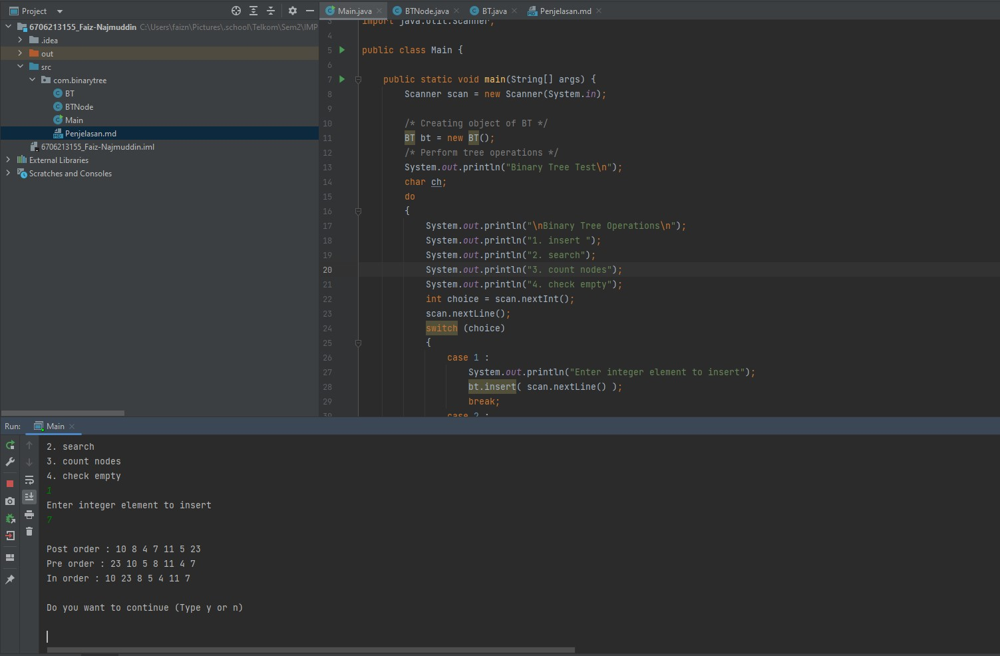
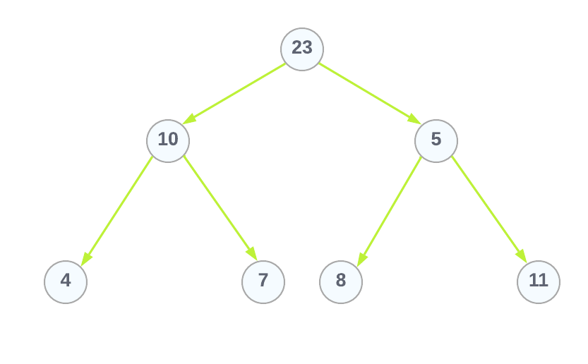

Nama : Faiz Najmuddin

NIM : 6706213155

Kelas : D3IF45-03

---

## Penjelasan Coding

### Penjelasan proses dari 4 operasi :

  ```
     do {
            System.out.println("\nBinary Tree Operations\n");
            System.out.println("1. insert ");
            System.out.println("2. search");
            System.out.println("3. count nodes");
            System.out.println("4. check empty");
           
  ```
* #### proses insert 

  method yang digunakan :

  - `.insert(E data)` berfungsi untuk menginisiasi `root` setiap data baru ditambahkan
  
  - `.insert(BTNode node, E data)` merupakan method recursive dan bagian dari method  `.insert(E data)`.  
  Yang berfungsi untuk membuat node baru dan sebagai iterator untuk menambahkan data.
  
* #### proses search

  method yang digunakan :

  - `.search(E val)` berfungsi mengembalikan _true_ apabila data yang dicari ada dan _false_ bila tidak ada 

  - `.search(BTNode r, E val)` merupakan method recursive dan bagian dari method  `.search(E val)`.  
    Yang berfungsi untuk mencari data yang sesuai dan sebagai iterator pencari data.

* #### proses count nodes

  method yang digunakan :

  - `.countNodes()` berfungsi menghitung jumlah node yang ada

  - `.countNodes(BTNode r)` merupakan method recursive dan bagian dari method  `.countNodes()`.  
    Yang berfungsi untuk menambahkan +1 ke total node setiap ponter `left` dan `right` bukan `null`  
    atau mengembalikan 0 jika `root` adalah null.

* #### proses check empty

  method yang digunakan :

  - `.isEmpty()` berfungsi mengembalikan `true` jika `root == null` dan `false` jika tidak `root == null`

---

### Hasil Jalannya Program
dengan inputan : 23 – 10 – 5 – 8 – 11 – 4 – 7



---

### Tree yang terbentuk dan penjelasannya
dengan inputan : 23 – 10 – 5 – 8 – 11 – 4 – 7


tree yang terbentuk seperti diatas, kenapa 8 merupakan child dari 5 dan bukan 10, karena 
kalau kita lihat proses method `insert(BTNode node, E data)` :
  ```
   private BTNode insert(BTNode node, E data)
      {
          if (node == null)
              node = new BTNode(data);
          else
          {
              if (node.getLeft() == null)
                  node.left = insert(node.left, data);
              else
                  node.right = insert(node.right, data);
          }
          return node;
      }
  ```
  
  saat height dari binary tree adalah 3 maka pointer `left` dan `right` dari root bukan sama dengan `null`,  
  berarti else atau `node.right = insert(node.right, data = 8)` dijalankan, sehingga 8 merupakan child dari 5,
  dan karena pointer `left` dari 5 adalah `null` maka 8 disimpan dalam pointer `left`
  
  ---

### penjelasan traversal preorder, inorder, dan postorder

* **Preorder**  
  mencetak node saat sekali dikunjungi iterator

* **Inorder**  
   mencetak node saat 2 kali dikunjungi iterator, atau saat salah satu child dari parent sudah dikunjungi

*  **Postorder**  
   mencetak node saat 3 kali dikunjungi iterator, atau saat kedua child dari parent sudah dikunjungi
